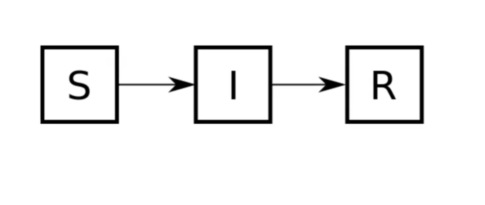

# Modeling Complex Systems - Week 3
**Date:** September 9, 2025  

---

## 📚 Setting the stage

Week 3! The first week was the usual business of introductions and defining the space. Given that I think its appropriate here to set the stage with some terminology. What is a complex system? What are some interesting properties of a complex system we might want to discuss when people ask me what I study and why. 

**complex system:** networks made of a number of components that interact with each other, typically in a nonlinear fashion, which may arise and evolve
through self-organization, such that they are neither completely regular nor completely random, permitting the development of emergent behavior at macroscopic
scales

A simpler, yet punchier definition might be "a whole that is more than the sum of its parts". In fact when we start to talk about modeling we will work from this definition. Before we jump into models, lets throw out a few more definitions.

**Emergence** is a nontrivial relationship between the properties of a system at microscopic and macroscopic scales. Macroscopic properties are called emergent when it
is hard to explain them simply from microscopic properties.

**Self-organization** is a dynamical process by which a system spontaneously forms
nontrivial macroscopic structures and/or behaviors over time.

## Types of models

**Scale:** when working with human population you might want to scale down the model for computational complexity.
**Idealized:**
- aristotelian: remove scale or color (ex. in forest fire modeling removing smell)
- galilean: distortion, approximating very large populations
**Analogical:** Classic example Mass Spring System, rich get richer shows up in scientific papers but in wealth as well
**"Phenomenological":** descriptive models

## Recipe for modeling
Start with the question: **What is the whole and what are the parts?**

For the **whole** consider:
- Space (2d or 3d)
- Time (discrete or continuous)
- Open or closed system

For the **parts** consider:
- What distinguishes the parts?
- What do the parts know? (memory)
- How do the interact?

**Compartmental models:**
- Compartments: boxes where homogenous behavior or as later clarified "indistinguishable parts of the system"
- Model mechanism: arrows that define the flow or change of state

**SIR Model Example**

In this example for the **whole** we might say it is a human population, or a fully connected network in discrete time. 

As for **parts** we might we are interested in people distinguished by infection state, susceptible, infected, or recovered. 

**Dynamical Systems:** a system whose state is uniquely specified by a set of variables and whose behavior is described by a predefined rules

**Phase Space:** a theoretical space where every state of the system is mapped to a unique spacial location.

From phase space we can learn about what happens over time in a system. Its worth mentioning we do not consider branching because this leads to multiple future states. Over time we might begin to see convergence or "attractors" (a converging point or a region) begin to form. ** An attractor is important for understanding self organization in complex systems". Second, you can learn how a system’s fate depends on its initial state. For each attractor, you can find the set of all the initial states from which you will eventually end up falling into that attractor. This set is called the **basin of attraction** of that attractor. 

Another thing you can learn from phase space visualizations is the **stability** of the
system’s states. If you see that trajectories are converging to a certain point or area in the phase space, that means the system’s state is stable in that area. But if you see
trajectories are diverging from a certain point or area, that means the system’s state is unstable in that area. Knowing system stability is often extremely important to understand, design, and/or control systems in real-world applications. The following chapters will put a particular emphasis on this stability issue.
